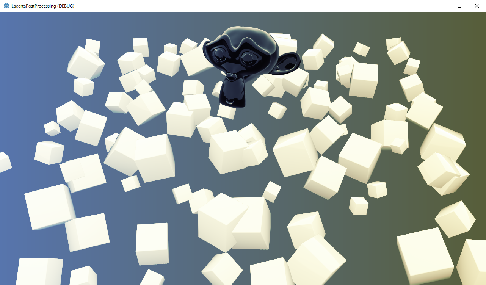
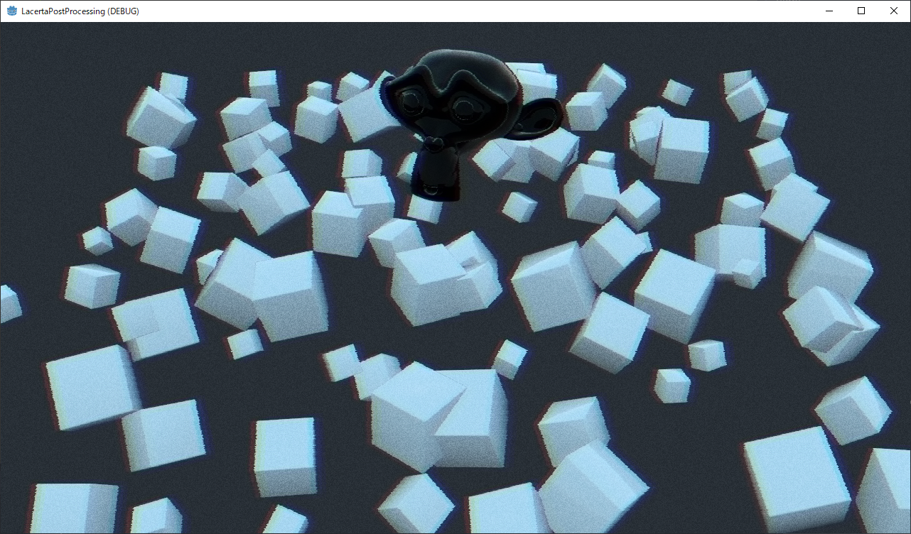

# Lacerta Post Processing

## Description

Some sample scenes with post processing for Godot.

## Preview

### Lens Effects

Special thanks by [Atarabi](https://atarabi.com/).

### Color Grading

#### Curve type

0. cos
1. bias
2. invert bias
3. curve texture

### VHS Effects

Reference of noise hash is [ShaderV](https://godotengine.org/asset-library/asset/589).

### One Direction Blur

### Bayer Dithering

## License

MIT
